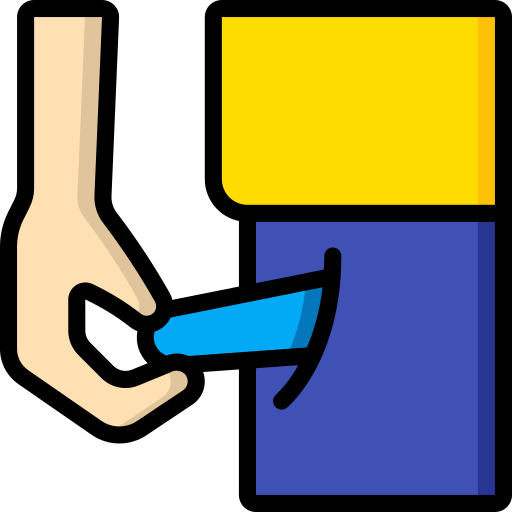

#  1. Pocket IHC

Este capítulo apresenta o "Pocket IHC", um guia rápido focado nos conceitos essenciais de usabilidade e design de interface. Aqui, sintetizamos as teorias que serviram como base para todas as decisões práticas tomadas ao longo do nosso projeto.

---

##  1.1 Tópicos da Disciplina
>  **Conceito Chave:** Utilize esta caixa de destaque para resumir a principal heurística ou regra de IHC explicada nesta seção.

Escreva seu conteúdo aqui...

---

##  1.2 Outros Conceitos
Escreva seu conteúdo aqui...

---

##  1.3 Próximos Passos
Escreva seu conteúdo aqui...

---

  <small style="opacity: 0.5;">Ícone por <a href="https://www.flaticon.com/br/autores/freepik" target="_blank">Freepik</a></small>

