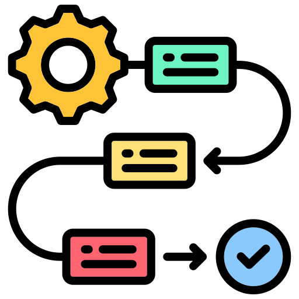

#  3. Metodologia de Avaliação

Nesta seção, descrevemos o percurso metodológico escolhido pelo grupo para auditar os sistemas. Detalhamos os métodos de inspeção e as técnicas de testes empíricos que guiaram a coleta de dados de usabilidade e IHC.

---

##  3.1 Checklist WCAG

Esta subseção apresenta o arcabouço normativo, legal e técnico que fundamentou a criação do Checklist Unificado de Acessibilidade adotado na auditoria do portal do Hospital Militar de Área de Brasília (HMAB).

---

### 🏛️ O Contexto Legal e Normativo no Setor Público

No âmbito da administração pública brasileira, a acessibilidade digital não se restringe a uma boa prática de <strong>design</strong>, mas constitui um cumprimento legal obrigatório apoiado por múltiplos instrumentos jurídicos:

* 🏛️ <strong>Lei Brasileira de Inclusão (Lei nº 13.146/2015 - LBI):</strong> Estipula a obrigatoriedade de que os serviços de tecnologia da informação e portais governamentais sejam plenamente acessíveis a pessoas com deficiência.
Disponível em: <a href="https://www.planalto.gov.br/ccivil_03/_ato2015-2018/2015/lei/l13146.htm" target="_blank">Portal do Planalto - Lei nº 13.146</a>.

* 📜 <strong>Decreto nº 5.296/2004:</strong> Estabelece as regras gerais e os critérios de engenharia básicos para a promoção da acessibilidade arquitetônica e digital. Disponível em: <a href="https://www.planalto.gov.br/ccivil_03/_ato2004-2006/2004/decreto/d5296.htm" target="_blank">Portal do Planalto - Decreto nº 5.296</a>.

* 🌍 <strong>Convenção Internacional sobre os Direitos das Pessoas com Deficiência (ONU, 2006):</strong> Integrada ao ordenamento jurídico nacional com equivalência de emenda constitucional pelo Decreto nº 6.949/2009.
Disponível em: <a href="https://www.unicef.org/brazil/convencao-sobre-os-direitos-das-pessoas-com-deficiencia" target="_blank">UNICEF - Convenção da ONU</a>.

Para traduzir esses comandos legais em especificações técnicas de <strong>software</strong>, o planejamento desta inspeção baseou-se no <strong>e-MAG (Modelo de Acessibilidade em Governo Eletrônico)</strong>, que fornece o guia de diretrizes de desenvolvimento específicas para o ecossistema público federal brasileiro.

---

### 📊 Estruturação do Checklist: WCAG 2.2 e ABNT NBR 17225:2025

A engenharia do instrumento de coleta de dados (o Checklist Unificado) consistiu na harmonização das recomendações internacionais de IHC com as atualizações mais recentes do cenário normativo técnico brasileiro:

1.  **Web Content Accessibility Guidelines (WCAG 2.2):** Utilizou-se a recomendação internacional emitida pelo W3C (2023) como o núcleo de critérios técnicos, cobrindo os níveis de conformidade <strong>A</strong> (requisitos básicos e impeditivos), <strong>AA</strong> (padrão internacional intermediário exigido legalmente para órgãos públicos) e <strong>AAA</strong> (critérios avançados e otimizados).

2.  **ABNT NBR 17225:2025:** Incorporou-se a norma técnica brasileira homóloga, que regula formalmente as exigências de acessibilidade para conteúdos e aplicações <strong>web</strong> no país.

Enquanto a norma técnica e o WCAG foram adotados como referências de conformidade formal, o grupo utilizou o <strong>Guia de Boas Práticas de Acessibilidade Digital (TG-04)</strong> como um manual de engenharia prático. Essa abordagem permitiu converter princípios abstratos de acessibilidade em validações concretas divididas em quatro frentes de projeto: <strong>Gestão de Projetos</strong>, <strong>Design de Interface</strong>,<strong>Desenvolvimento (Front-End)</strong> e <strong>Geração de Conteúdo</strong>.

---

### 🧬 Os Quatro Princípios Orientadores (POUR)

Para viabilizar a auditoria, o checklist foi estruturado de forma a segmentar cada item de verificação segundo os quatro macro-princípios fundamentais do desenvolvimento acessível estabelecidos pelo WCAG:

* **Perceptível:** Critérios para garantir que as informações e os componentes da interface fiquem visíveis e discerníveis aos usuários através de múltiplos canais sensoriais (como texto alternativo para imagens, contraste e suporte a leitores de tela).
* **Operável:** Diretrizes focadas na navegabilidade e no controle da interface, assegurando que o usuário consiga interagir com sucesso através de entradas alternativas (como teclado ou comandos de voz) e sem restrições críticas de tempo ou armadilhas de foco.
* **Compreensível:** Requisitos para certificar que o funcionamento do sistema seja previsível, e que os textos, rótulos e mensagens de erro sejam intuitivos e fáceis de assimilar.
* **Robusto:** Padrões de código limpo e semântico necessários para assegurar a interoperabilidade retroativa e a compatibilidade da aplicação com diferentes navegadores e tecnologias assistivas atuais.

---

##  3.2 Avaliação Heurística (Especialistas)

Esta subseção apresenta o planejamento metodológico da inspeção técnica realizada no portal do Hospital Militar de Área de Brasília (HMAB), conduzida sob a perspectiva de engenharia de usabilidade e design centrado no usuário.

---

### 📂 Fundamentação Teórica: Heurísticas e Pilares de UX

A auditoria por especialistas foi estruturada com base nas dez heurísticas de usabilidade de Jakob Nielsen (1994) e nos conceitos clássicos de design de Donald Norman (2013), que defendem que uma interface deve ser operada com naturalidade e sem causar frustrações cognitivas ao usuário.

Para guiar o olhar analítico dos inspetores, o planejamento consolidou a avaliação sob <strong>quatro pilares de IHC fundamentais</strong> para mitigar o espaço mental do paciente:

* **Foco na Visão do Paciente (*Outside-In*):** Planejou-se verificar se o fluxo das telas reflete o modelo mental e as necessidades reais do paciente, ou se a interface replica uma estrutura puramente administrativa e organizacional interna do hospital.
* **Facilidade de Ação e Entendimento (Design Intuitivo):** Avaliação da clareza da interface em indicar como executar uma ação e se o sistema fornece *feedbacks* imediatos e adequados de sucesso ou erro (evitando retrabalho ou insegurança).
* **Redução de Carga Cognitiva:** Baseado no princípio de *"Reconhecimento em vez de Memorização"*, o planou consistiu em mapear se caminhos, avisos e botões críticos permanecem visíveis sem exigir que o usuário memorize etapas anteriores.
* **Organização Visual Inteligente (Regras de Gestalt):** Mapeamento do layout com base em regras de agrupamento visual — *Proximidade* para dados semelhantes, *Similaridade* para padrões de cores e formatos de botões, e *Fechamento* para a delimitação limpa de blocos de conteúdo.

---

### 🛠️ Método de Inspeção: *Guideline Inspection* e Princípios POUR

A abordagem prática escolhida foi o método de <strong>Inspeção por Linhas de Diretrizes (Guideline Inspection)</strong>. Para isso, o grupo projetou um <strong>Checklist Unificado</strong> combinando as normas internacionais do <strong>WCAG 2.2</strong> (níveis de conformidade A, AA e AAA), o modelo nacional <strong>e-MAG</strong> (Modelo de Acessibilidade em Governo Eletrônico) e os requisitos técnicos formais da <strong>ABNT NBR 17225:2025</strong>.

A triagem técnica das inconformidades foi dividida sistematicamente através dos quatro macro-princípios do desenvolvimento acessível:

1.  **Perceptível:** Investigação da capacidade de o usuário discernir informações e componentes da interface por meio de canais sensoriais alternativos (ex: leitores de tela ou auto-contraste).
2.  **Operável:** Verificação se a interface é totalmente controlável e navegável por diferentes modalidades físicas e periféricos, avaliando exaustivamente a navegação exclusiva via teclado.
3.  **Compreensível:** Análise da clareza da linguagem utilizada (evitando jargões sem apoio) e se existem mecanismos previsíveis para prevenir ou corrigir erros de preenchimento.
4.  **Robusto:** Avaliação da qualidade e limpeza do código-fonte para garantir compatibilidade retroativa e interoperabilidade estável com tecnologias assistivas modernas.

---

### 💻 Ferramentas e Dinâmica de Execução

O planejamento da inspeção definiu uma abordagem mista, unindo automação e análise manual criteriosa feita pela equipe de desenvolvimento:

* **Inspeção Automatizada:** Uso planejado de ferramentas de validação de código (como o *WAVE Web Accessibility Evaluation Tool*) e simuladores automatizados de contraste cromático para obter métricas matemáticas precisas de legibilidade.
* **Inspeção Manual Especializada:** Ensaios de navegação manual simulando o uso de tecnologias assistivas através de leitores de tela (*NVDA* e *VoiceOver*), testes rigorosos de varredura utilizando exclusivamente a tecla `Tab` para checar a ordem lógica do foco, e testes multiplataforma nos principais navegadores do mercado (*Chrome, Firefox, Edge e Safari*).

Por fim, os dados brutos e planilhados resultantes dessa estrutura de auditoria foram organizados para posterior cruzamento em uma matriz de prioridades, avaliando o impacto gerado na experiência do usuário (*UX*) contra o espetáculo técnico de engenharia de software necessário para a sua correção.

---

##  3.3 Teste de Usabilidade (Usuário)

Esta subseção detalha o planejamento metodológico e a estruturação teórica adotados para a condução do teste empírico de usabilidade com um usuário real do ecossistema de saúde do Hospital Militar de Área de Brasília (HMAB).

---

### 📂 Fundamentação Metodológica: O Protocolo de Pensar em Voz Alta (*Think Aloud*)

Para a execução do teste, optou-se pela aplicação do <strong>Protocolo de Pensar em Voz Alta (Think Aloud)</strong>, conforme preconizado por Nielsen (1993). Sob essa ótica metodológica, o participante é instruído a verbalizar ativamente seus pensamentos, intenções, dúvidas e sentimentos enquanto interage com o sistema.

A escolha dessa abordagem justifica-se pela capacidade de fornecer dados qualitativos profundos sobre os processos cognitivos do usuário, permitindo aos inspetores identificar exatamente onde ocorrem as falhas de legibilidade, quebras de expectativa e barreiras de navegação, sem interferir diretamente na ação.

Antes do início da interação, uma diretriz fundamental de IHC foi explicitada à participante para mitigar a ansiedade de desempenho: <strong>o objeto sob avaliação é o sistema, e não as habilidades individuais do usuário</strong>. A participante foi conscientizada de que qualquer dificuldade ou erro cometido representaria uma desconformidade de *design* atribuível exclusivamente à interface do portal.

---

### 📑 Estruturação do Roteiro de Tarefas (Cenários de Uso)

O teste foi baseado em cenários de uso reais e cotidianos, projetados para cobrir desde necessidades informacionais básicas até fluxos transacionais complexos e críticos dentro do portal móvel do hospital. As tarefas foram redigidas de forma a simular um objective prático, evitando termos literais da interface para não enviesar a navegação:

* **Cenário 1: Busca por Informação Básica (Contato)**
    * **Objetivo de IHC:** Avaliar a arquitetura de informação do portal, a clareza taxonômica dos menus e a facilidade de localização de dados institucionais essenciais (Princípios WCAG: Compreensível e Operável).
    * **Instrução Fornecida:** *"Imagine que precisa de tirar uma dúvida sobre exames de sangue ou agendamentos. Tente encontrar no site o telefone de contacto da Recepção ou do Laboratório do hospital."*

* **Cenário 2: Tarefa Principal (Agendamento de Consulta)**
    * **Objetivo de IHC:** Investigar o fluxo transacional de maior criticidade e valor do portal, detectando barreiras na navegação de formulários, tabelas dinâmicas e elementos de controle de tela.
    * **Instrução Fornecida:** *"Agora, imagine que precisa de marcar uma consulta com um Ortopedista. Mostre como faria para iniciar esse agendamento pelo site."*

* **Cenário 3: Autenticação (Área do Paciente / Login)**
    * **Objetivo de IHC:** Analisar a visibilidade e o comportamento de zonas restritas, mecanismos de segurança indispensáveis (como preenchimento de *Captcha*) e a clareza de rótulos de hiperligações (Diretriz WCAG 2.4.4).
    * **Instrução Fornecida:** *"Já passou pela consulta e agora o médico pediu-lhe para entrar no site e obter o resultado de um exame. Como faria para aceder à sua área restrita (fazer login) no portal?"*

* **Cenário 4: Descoberta de Ferramentas de Acessibilidade**
    * **Objetivo de IHC:** Verificar a existência, eficácia prática e o grau de descoberta de mecanismos nativos de apoio a utilizadores com baixa visão (ex: leitores de tela, botões de alto contraste ou redimensionamento de fontes).
    * **Instrução Fornecida:** *"Digamos que se esqueceu dos seus óculos e a letra está muito pequena. Consegue encontrar alguma opção no próprio site para aumentar o texto ou melhorar a cor do ecrã para facilitar a leitura?"*

---

### 📊 Métricas Qualitativas e Quantitativas Definidas

Para avaliar o desempenho de forma objetiva, o planejamento estruturou a coleta de dados com base em duas métricas principais:

1.  **Eficácia (Conclusão da Tarefa):** Mapeada categoricamente entre *Sucesso*, *Sucesso Parcial* ou *Falha Completa*, observando se a usuária atingia o objetivo proposto de forma autônoma.
2.  **Satisfação e Carga de Trabalho (Dificuldade Percebida):** Mensurada por meio de uma escala ordinal de 1 a 5, coletada imediatamente após o encerramento de cada cenário, onde a nota **1** indica facilidade plena e a nota **5** representa dificuldade máxima percebida pelo usuário.

---

### 🛡️ Aspectos Éticos e Termo de Consentimento (TCLE)

Em conformidade com os aspectos éticos de pesquisas envolvendo seres humanos em IHC, a realização do teste foi condicionada à apresentação e esclarecimento prévio dos objetivos do estudo. Foi assegurado à participante o total anonimato quanto à sua identidade e o direito de interromper o teste a qualquer momento, sem justificativa ou penalidade. O consentimento verbal e a autorização para registro de áudio e anotações foram obtidos estritamente para fins de análise acadêmica e mapeamento de engenharia de interface, conforme documentado na seção de <a href="6_anexos.html">Anexos</a> do projeto.

---

  <small style="opacity: 0.5;">Ícone por <a href="https://www.flaticon.com/br/autores/freepik" target="_blank">Freepik</a></small>

