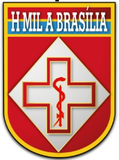

#  4. Avaliação na Prática

Relato prático da execução das avaliações. Esta página documenta o ecossistema real do teste, apresentando a interface escolhida, as personas envolvidas e as tarefas específicas que foram monitoradas.

---

##  4.1 O Site Avaliado

>  **Contexto do Sistema:** 
> 
> 

> O site oficial do Hospital Militar de Área de Brasília (HMAB) é um portal institucional e de prestação de serviços de saúde voltado exclusivamente para os militares do Exército Brasileiro (ativos, da reserva e reformados) e seus dependentes legais na Região Mandatária da 11ª Região Militar.
> 

> 
> 

> A plataforma serve como o principal canal digital de comunicação e autoatendimento para os beneficiários do FUSEX (Fundo de Saúde do Exército) e do SAMMED. Por meio dele, os usuários podem realizar o agendamento online de consultas e exames, consultar escalas médicas, acessar resultados de laudos laboratoriais e obter informações atualizadas sobre guias de encaminhamento externo, além de acompanhar avisos institucionais da direção do hospital. É uma ferramenta essencial para centralizar o suporte à saúde militar na capital federal, otimizando o fluxo de atendimento e promovendo a transparência administrativa da organização de saúde.
> 

>
> ---
>  
> 

>   
<strong>Acesse o site oficial:</strong>

>   <a href="https://hmab.eb.mil.br/" target="_blank">
>     
>     Portal HMAB
>   </a>
> 

---

##  4.2 O Perfil do Usuário e Contexto
Escreva seu conteúdo aqui...

---

##  4.3 Cenário de Teste
Escreva seu conteúdo aqui...

---

  <small style="opacity: 0.5;">Ícone por <a href="https://www.flaticon.com/br/autores/freepik" target="_blank">Freepik</a></small>

