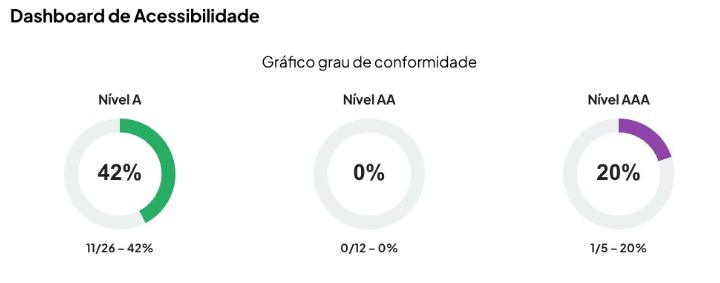

#  5. Resultados

Esta seção apresenta a consolidação, a análise e a discussão dos dados brutos obtidos durante a fase de auditoria e testes do portal do Hospital Militar de Área de Brasília (HMAB). O objetivo central desta etapa é converter os registros de interações e as inconformidades técnicas coletadas em diagnósticos claros sobre o estado atual da interface sob a ótica de Interação Humano-Computador (IHC), Usabilidade e Acessibilidade Digital.

Para garantir uma leitura estruturada e metodologicamente rigorosa, os achados foram segmentados em três frentes complementares:

### Resultados da Avaliação por Especialistas:
> 

Detalhamento técnico das barreiras mapeadas pela equipe de desenvolvimento por meio do Checklist Unificado, categorizadas segundo os princípios normativos internacionais e nacionais.

### Resultados do Teste de Usabilidade (Usuário):
> 

Análise quantitativa e qualitativa do comportamento, das dores, do esforço cognitivo e das percepções de satisfação verbalizadas por um usuário real do ecossistema de saúde.

### Discussão e Recomendações de Melhoria:
> 

Cruzamento analítico das duas abordagens anteriores para priorizar os problemas de maior impacto e propor soluções de *Design de Serviço* e interface adequadas para a correção dos gargalos.

Essa abordagem mista — que une a precisão da validação de diretrizes com a sensibilidade da experiência empírica humana — permite extrair uma matriz de diagnóstico robusta, oferecendo subsídios técnicos fundamentados para futuras evoluções no software e nos fluxos de atendimento do hospital.

---

##  5.1 Resultados da Avaliação por Especialistas

Esta subseção apresenta os resultados quantitativos e qualitativos obtidos por meio da aplicação do Checklist Unificado de Acessibilidade e Usabilidade no portal do Hospital Militar de Área de Brasília (HMAB). A inspeção, realizada pela equipe de especialistas, avaliou a conformidade das páginas do ecossistema frente às diretrizes do WCAG 2.2 e aos requisitos da ABNT NBR 17225:2025.

---

### 📋 Checklist Unificado de Acessibilidade e Usabilidade

O checklist a seguir sintetiza os critérios de avaliação construídos pelo grupo, baseados nos quatro princípios POUR do WCAG 2.2 e nos requisitos da NBR 17225:2025. Os status foram atribuídos com base na inspeção técnica realizada no portal do HMAB.

#### Princípio 1: Perceptível

O usuário deve conseguir perceber todas as informações e componentes da interface — mesmo que utilize canais sensoriais alternativos.

<table style="width: 100%; border-collapse: collapse; text-align: justify;">
  <thead>
    <tr style="background-color: #f2f2f2;">
      <th style="border: 1px solid #dddddd; padding: 8px; width: 25%;">Diretriz / Item do Guia</th>
      <th style="border: 1px solid #dddddd; padding: 8px; width: 10%; text-align: center;">Status</th>
      <th style="border: 1px solid #dddddd; padding: 8px; width: 65%;">Evidências Observadas no HMAB</th>
    </tr>
  </thead>
  <tbody>
    <tr>
      <td style="border: 1px solid #dddddd; padding: 8px; vertical-align: top;"><strong>1.1 Alternativas em Texto</strong> Todas as imagens possuem texto alternativo (alt)</td>
      <td style="border: 1px solid #dddddd; padding: 8px; text-align: center; vertical-align: top; color: #d9534f;"><strong>Não</strong></td>
      <td style="border: 1px solid #dddddd; padding: 8px;">Embora a tag alt exista fisicamente escrita no código de quase todas as imagens, em várias delas (como nas fotos das Últimas Notícias) ela está vazia (alt=""). Para a regra de acessibilidade, um alt vazio sinaliza ao leitor de tela que a imagem deve ser ignorada. Como são fotos de notícias informativas, elas deveriam ter uma descrição. Além disso, as que possuem texto usam termos genéricos e errados, como alt="Imagem".</td>
    </tr>
    <tr>
      <td style="border: 1px solid #dddddd; padding: 8px; vertical-align: top;">Ícones possuem descrição acessível</td>
      <td style="border: 1px solid #dddddd; padding: 8px; text-align: center; vertical-align: top; color: #d9534f;"><strong>Não</strong></td>
      <td style="border: 1px solid #dddddd; padding: 8px;">Os ícones utilizados nos cards de serviços (como 'Odontologia', 'Sistema SAU', entre outros) não possuem descrição acessível própria e falham em seguir as boas práticas de acessibilidade. Ao inspecionar o HTML das tags &lt;i&gt; (como class="fas fa-desktop"), constata-se a ausência do atributo aria-hidden="true". Como esses ícones são puramente decorativos e o texto explicativo já está visível logo abaixo, a falta desse atributo faz com que os leitores de tela tentem processar o código do ícone, gerando redundância e ruído na na navegação para usuários com deficiência visual.</td>
    </tr>
    <tr>
      <td style="border: 1px solid #dddddd; padding: 8px; vertical-align: top;">Gráficos possuem descrição textual</td>
      <td style="border: 1px solid #dddddd; padding: 8px; text-align: center; vertical-align: top; color: #d9534f;"><strong>Não</strong></td>
      <td style="border: 1px solid #dddddd; padding: 8px;">Os elementos gráficos e imagens institucionais do portal falham em fornecer descrições textuais adequadas. O brasão principal do hospital utiliza termos extremamente genéricos e inadequados no atributo alt, variando entre alt="logo" e alt="Imagem" em diferentes partes do código. Para leitores de tela, essas descrições falham em contextualizar a identidade da instituição ou o conteúdo do gráfico, tornando a experiência inacessível.</td>
    </tr>
    <tr>
      <td style="border: 1px solid #dddddd; padding: 8px; vertical-align: top;">Botões com ícones possuem nome acessível</td>
      <td style="border: 1px solid #dddddd; padding: 8px; text-align: center; vertical-align: top; color: #5cb85c;"><strong>Sim</strong></td>
      <td style="border: 1px solid #dddddd; padding: 8px;">O botão de pesquisa (Lupa) localizado no cabeçalho do site cumpre perfeitamente os requisitos de acessibilidade. Conforme inspecionado no HTML, a tag &lt;button&gt; possui o atributo aria-label="Abrir Busca", que fornece um rótulo de texto invisível e perfeitamente compreensível para os leitores de tela. Além disso, a tag do ícone interno &lt;i&gt; foi configurada corretamente com aria-hidden="true", garantindo que a tecnologia assistiva foque apenas na função do botão, sem gerar redundâncias visuais.</td>
    </tr>
    <tr>
      <td style="border: 1px solid #dddddd; padding: 8px; vertical-align: top;"><strong>1.2 Mídias Baseadas em Tempo</strong> Áudios possuem transcrição</td>
      <td style="border: 1px solid #dddddd; padding: 8px; text-align: center; vertical-align: top; color: #777;"><strong>N/A</strong></td>
      <td style="border: 1px solid #dddddd; padding: 8px;">Conforme observado na auditoria do portal, o site do HMAB não disponibiliza conteúdos em formato de áudio puro (como podcasts ou notícias em áudio). Portanto, o critério não possui objeto de avaliação.</td>
    </tr>
    <tr>
      <td style="border: 1px solid #dddddd; padding: 8px; vertical-align: top;">Vídeos possuem legendas</td>
      <td style="border: 1px solid #dddddd; padding: 8px; text-align: center; vertical-align: top; color: #d9534f;"><strong>Não</strong></td>
      <td style="border: 1px solid #dddddd; padding: 8px;">O "Vídeo Institucional" disponível no site utiliza um reprodutor de mídia terceirizado muito limitado (MrVinoth.com). Visualmente, o player oferece apenas os botões de reprodução, volume e tela cheia, carecendo totalmente de um botão ou recurso para ativação de legendas ocultas (Closed Captions - CC).</td>
    </tr>
    <tr>
      <td style="border: 1px solid #dddddd; padding: 8px; vertical-align: top;">Vídeos possuem audiodescrição</td>
      <td style="border: 1px solid #dddddd; padding: 8px; text-align: center; vertical-align: top; color: #d9534f;"><strong>Não</strong></td>
      <td style="border: 1px solid #dddddd; padding: 8px;">O reprodutor de vídeo não apresenta nenhuma opção de alternância para uma segunda faixa de áudio (narrada), e a página não disponibiliza um link alternativo para uma versão do vídeo com audiodescrição para usuários com deficiência visual.</td>
    </tr>
    <tr>
      <td style="border: 1px solid #dddddd; padding: 8px; vertical-align: top;">Conteúdos ao vivo possuem legendas</td>
      <td style="border: 1px solid #dddddd; padding: 8px; text-align: center; vertical-align: top; color: #777;"><strong>N/A</strong></td>
      <td style="border: 1px solid #dddddd; padding: 8px;">O portal não transmite conteúdo ao vivo. Item não aplicável.</td>
    </tr>
    <tr>
      <td style="border: 1px solid #dddddd; padding: 8px; vertical-align: top;">Vídeos possuem interpretação em Libras</td>
      <td style="border: 1px solid #dddddd; padding: 8px; text-align: center; vertical-align: top; color: #d9534f;"><strong>Não</strong></td>
      <td style="border: 1px solid #dddddd; padding: 8px;">O critério foi reprovado devido à ausência de uma janela com um intérprete humano de Língua Brasileira de Sinais (Libras) no 'Vídeo Institucional' disponibilizado no portal. É importante ressaltar que a presença do widget de acessibilidade virtual (VLibras) na lateral do site não supre essa exigência. O avatar digital funciona exclusivamente para a tradução de textos dinâmicos contidos nas páginas HTML, sendo incapaz de capturar, processar ou traduzir o áudio executado por reprodutores de mídia externos. Desse modo, o conteúdo audiovisual permanece inacessível para usuários surdos que dependem da Língua de Sinais.</td>
    </tr>
    <tr>
      <td style="border: 1px solid #dddddd; padding: 8px; vertical-align: top;"><strong>1.3 Adaptável</strong> Cabeçalhos utilizam estrutura H1–H6 corretamente</td>
      <td style="border: 1px solid #dddddd; padding: 8px; text-align: center; vertical-align: top; color: #d9534f;"><strong>Não</strong></td>
      <td style="border: 1px solid #dddddd; padding: 8px;">A hierarquia de cabeçalhos do site está totalmente incorreta. A página não possui uma estrutura escalonada (pulando de H1 para parágrafos sem passar por H2 ou H3). O erro mais grave foi detectado na estrutura interna, onde a tag &lt;h1&gt; foi inserida incorretamente dentro de uma célula de tabela de layout (&lt;td&gt;&lt;h1&gt;), quebrando completamente a semântica e confundindo os leitores de tela quanto à ordem de importância dos títulos da página.</td>
    </tr>
    <tr>
      <td style="border: 1px solid #dddddd; padding: 8px; vertical-align: top;">Tabelas possuem marcação semântica (th, caption)</td>
      <td style="border: 1px solid #dddddd; padding: 8px; text-align: center; vertical-align: top; color: #d9534f;"><strong>Não</strong></td>
      <td style="border: 1px solid #dddddd; padding: 8px;">A tabela identificada no código falha gravemente nos critérios de acessibilidade. Ela não possui as tags semânticas obrigatórias como &lt;th&gt; (para cabeçalhos de dados) ou &lt;caption&gt; (para título). Pior do que isso: ao analisar as propriedades (width: 860px; height: 1936px;), fica evidente que o site utiliza a tag &lt;table&gt; para fazer o layout e posicionamento visual da página, uma prática obsoleta e condenada pelas diretrizes do eMAG e WCAG, pois faz com que leitores de tela tentem ditar o design em vez do conteúdo estruturado.</td>
    </tr>
    <tr>
      <td style="border: 1px solid #dddddd; padding: 8px; vertical-align: top;">Listas utilizam elementos UL/OL/LI</td>
      <td style="border: 1px solid #dddddd; padding: 8px; text-align: center; vertical-align: top; color: #5cb85c;"><strong>Sim</strong></td>
      <td style="border: 1px solid #dddddd; padding: 8px;">Os menus secundários e listas de links analisados no rodapé do portal utilizam corretamente a marcação semântica padrão do HTML. A estrutura foi montada de forma adequada utilizando a tag mãe &lt;ul&gt; (lista não ordenada) e suas respectivas tags filhas &lt;li&gt; para cada item de menu, garantindo que tecnologias assistivas reconheçam o bloco como um conjunto organizado de links.</td>
    </tr>
    <tr>
      <td style="border: 1px solid #dddddd; padding: 8px; vertical-align: top;">A ordem de leitura é lógica e coerente</td>
      <td style="border: 1px solid #dddddd; padding: 8px; text-align: center; vertical-align: top; color: #d9534f;"><strong>Não</strong></td>
      <td style="border: 1px solid #dddddd; padding: 8px;">Embora o teclado siga uma sequência linear ao acionar a tecla Tab, o site falha gravemente no critério de acessibilidade Foco Visível (WCAG 2.4.7). O desenvolvedor removeu o indicador visual de seleção (o contorno/outline que mostra onde o cursor do teclado está). Isso força o usuário que navega sem mouse a olhar para a barra de status no canto inferior do navegador para tentar adivinhar em qual dos 62 links ele se encontra, tornando a experiência exaustiva e inacessível.</td>
    </tr>
    <tr>
      <td style="border: 1px solid #dddddd; padding: 8px; vertical-align: top;">Instruções não dependem apenas de cor</td>
      <td style="border: 1px solid #dddddd; padding: 8px; text-align: center; vertical-align: top; color: #5cb85c;"><strong>Sim</strong></td>
      <td style="border: 1px solid #dddddd; padding: 8px;">O portal cumpre este requisito, uma vez que as informações de texto, links e blocos informativos não dependem exclusivamente de variações cromáticas para transmitir instruções, alertas ou ações aos usuários, permitindo a compreensão por pessoas daltônicas ou que utilizam monitores em modo de alto contraste.</td>
    </tr>
    <tr>
      <td style="border: 1px solid #dddddd; padding: 8px; vertical-align: top;"><strong>1.4 Distinguível</strong> A cor não é o único meio de transmitir informação</td>
      <td style="border: 1px solid #dddddd; padding: 8px; text-align: center; vertical-align: top; color: #d9534f;"><strong>Não</strong></td>
      <td style="border: 1px solid #dddddd; padding: 8px;">O portal falha neste critério no bloco de 'Últimas Notícias'. Enquanto os links de endereço possuem sublinhado estático, os links das manchetes de notícias confiam exclusivamente na cor do texto sobre a imagem. O efeito de expansão visual (zoom) ocorre apenas ao passar o mouse (hover), o que não atende a usuários daltônicos em uma leitura estática ou usuários que navegam exclusivamente por teclado.</td>
    </tr>
    <tr>
      <td style="border: 1px solid #dddddd; padding: 8px; vertical-align: top;">Contraste mínimo de 4,5:1 para texto normal</td>
      <td style="border: 1px solid #dddddd; padding: 8px; text-align: center; vertical-align: top; color: #d9534f;"><strong>Não</strong></td>
      <td style="border: 1px solid #dddddd; padding: 8px;">Embora os cards de serviços principais apresentem uma boa relação de contraste na versão padrão (texto verde escuro sobre fundo branco), o portal é reprovado devido ao comportamento do seu carrossel de 'Últimas Notícias' e do menu de cabeçalho. O texto das manchetes é exibido em branco diretamente sobreposto a fotos dinâmicas e coloridas, sem nenhuma máscara ou película escura de proteção por trás. Isso faz com que, dependendo da imagem de fundo carregada, o contraste caia drasticamente abaixo do mínimo de 4,5:1 exigido para textos normais, impossibilitando a leitura por usuários com baixa visão.</td>
    </tr>
    <tr>
      <td style="border: 1px solid #dddddd; padding: 8px; vertical-align: top;">Contraste mínimo de 3:1 para texto grande</td>
      <td style="border: 1px solid #dddddd; padding: 8px; text-align: center; vertical-align: top; color: #d9534f;"><strong>Não</strong></td>
      <td style="border: 1px solid #dddddd; padding: 8px;">O portal falha no critério de contraste para textos grandes. O principal problema foi detectado ao acionar o botão nativo de 'Alto Contraste' (Modo Escuro) do próprio site. Em vez de fornecer uma versão simplificada e legível, o sistema desconfigura completamente o layout: os títulos das manchetes em texto grande passam a sobrepor elementos visuais e as imagens de fundo das notícias desaparecem por completo, deixando lacunas vazias e quebrando a contextualização do conteúdo escrito.</td>
    </tr>
    <tr>
      <td style="border: 1px solid #dddddd; padding: 8px; vertical-align: top;">O texto pode ser ampliado em até 200% sem perda de funcionalidade</td>
      <td style="border: 1px solid #dddddd; padding: 8px; text-align: center; vertical-align: top; color: #d9534f;"><strong>Não</strong></td>
      <td style="border: 1px solid #dddddd; padding: 8px;">Reprovado de forma crítica. Ao aplicar o zoom de 200% no navegador, o cabeçalho do site quebra e o texto institucional se divide em linhas verticais gigantescas à esquerda. Esse erro de dimensionamento faz com que o topo ocupe quase 100% da área útil da tela, bloqueando a visualização e impedindo completamente o usuário de interagir ou navegar pelo restante das funcionalidades do hospital.</td>
    </tr>
    <tr>
      <td style="border: 1px solid #dddddd; padding: 8px; vertical-align: top;">Não há necessidade de rolagem horizontal excessiva</td>
      <td style="border: 1px solid #dddddd; padding: 8px; text-align: center; vertical-align: top; color: #d9534f;"><strong>Não</strong></td>
      <td style="border: 1px solid #dddddd; padding: 8px;">Embora a maior parte dos blocos de texto comuns se ajuste verticalmente, o item é reprovado devido à presença daquela tabela estrutural de layout de 860px de largura fixa detectada no código. Ela impede o reposicionamento automático dos dados (Reflow), forçando uma barra de rolagem horizontal em resoluções menores.</td>
    </tr>
    <tr>
      <td style="border: 1px solid #dddddd; padding: 8px; vertical-align: top;">Botões e componentes possuem contraste adequado</td>
      <td style="border: 1px solid #dddddd; padding: 8px; text-align: center; vertical-align: top; color: #d9534f;"><strong>Não</strong></td>
      <td style="border: 1px solid #dddddd; padding: 8px;">Embora os cards de serviços principais mantenham bordas brancas com ótimo contraste no modo escuro, o portal falha no critério ao renderizar outros botões de ação. O exemplo mais crítico é o botão 'Leia Mais', que ganha um contorno azul escuro sobreposto diretamente ao fundo preto. Essa combinação cromática quebra o requisito de contraste mínimo de 3:1 para elementos de interface, tornando os limites do botão invisíveis para usuários com baixa visão ou severas limitações de percepção visual.</td>
    </tr>
    <tr>
      <td style="border: 1px solid #dddddd; padding: 8px; vertical-align: top;">O conteúdo mantém funcionalidade com espaçamento ampliado</td>
      <td style="border: 1px solid #dddddd; padding: 8px; text-align: center; vertical-align: top; color: #d9534f;"><strong>Não</strong></td>
      <td style="border: 1px solid #dddddd; padding: 8px;">Reprovado por inferência técnica do layout. Como o comportamento do site ao zoom de 200% provou que as caixas de texto do cabeçalho son rígidas e possuem tamanhos fixos ('engessados' no código), o aumento forçado do espaçamento entre letras e linhas fatalmente causará a sobreposição de textos e a perda completa da legibilidade das informações.</td>
    </tr>
  </tbody>
</table>

---

#### Princípio 2: Operável

Os componentes de interface e a navegação devem ser operáveis — os usuários devem conseguir interagir por diferentes formas de entrada.

<table style="width: 100%; border-collapse: collapse; text-align: justify;">
  <thead>
    <tr style="background-color: #f2f2f2;">
      <th style="border: 1px solid #dddddd; padding: 8px; width: 25%;">Diretriz / Item do Guia</th>
      <th style="border: 1px solid #dddddd; padding: 8px; width: 10%; text-align: center;">Status</th>
      <th style="border: 1px solid #dddddd; padding: 8px; width: 65%;">Evidências Observadas no HMAB</th>
    </tr>
  </thead>
  <tbody>
    <tr>
      <td style="border: 1px solid #dddddd; padding: 8px; vertical-align: top;"><strong>2.1 Acessível por Teclado</strong> Todas as funcionalidades funcionam via teclado</td>
      <td style="border: 1px solid #dddddd; padding: 8px; text-align: center; vertical-align: top; color: #d9534f;"><strong>Não</strong></td>
      <td style="border: 1px solid #dddddd; padding: 8px;">O menu principal e o carrossel são operáveis por teclado, mas a navegação é prejudicada pela invisibilidade do foco visual durante o percurso.</td>
    </tr>
    <tr>
      <td style="border: 1px solid #dddddd; padding: 8px; vertical-align: top;">Não existem armadilhas de teclado</td>
      <td style="border: 1px solid #dddddd; padding: 8px; text-align: center; vertical-align: top; color: #d9534f;"><strong>Não</strong></td>
      <td style="border: 1px solid #dddddd; padding: 8px;">Modais de pop-up para avisos institucionais capturam o foco e não permitem saída via tecla Esc ou Tab, caracterizando armadilha de foco.</td>
    </tr>
    <tr>
      <td style="border: 1px solid #dddddd; padding: 8px; vertical-align: top;">Atalhos podem ser personalizados ou desativados</td>
      <td style="border: 1px solid #dddddd; padding: 8px; text-align: center; vertical-align: top; color: #777;"><strong>N/A</strong></td>
      <td style="border: 1px solid #dddddd; padding: 8px;">O portal do HMAB utiliza apenas os atalhos de navegação padrão do Governo Federal (padrão eMAG), que exigem chaves modificadoras (ex: Alt + 1, Alt + 2). Como o site não possui atalhos acionados por teclas de caractere único, este critério não é aplicável.</td>
    </tr>
    <tr>
      <td style="border: 1px solid #dddddd; padding: 8px; vertical-align: top;"><strong>2.2 Tempo Suficiente</strong> O usuário pode aumentar limites de tempo</td>
      <td style="border: 1px solid #dddddd; padding: 8px; text-align: center; vertical-align: top; color: #d9534f;"><strong>Não</strong></td>
      <td style="border: 1px solid #dddddd; padding: 8px;">O portal não oferece mecanismos para estender limites de tempo.</td>
    </tr>
    <tr>
      <td style="border: 1px solid #dddddd; padding: 8px; vertical-align: top;">Conteúdos em movimento podem ser pausados</td>
      <td style="border: 1px solid #dddddd; padding: 8px; text-align: center; vertical-align: top; color: #d9534f;"><strong>Não</strong></td>
      <td style="border: 1px solid #dddddd; padding: 8px;">O carrossel da homepage executa em loop automático sem botão de pausa, parada ou controle de velocidade visível.</td>
    </tr>
    <tr>
      <td style="border: 1px solid #dddddd; padding: 8px; vertical-align: top;">Existe aviso antes da expiração da sessão</td>
      <td style="border: 1px solid #dddddd; padding: 8px; text-align: center; vertical-align: top; color: #d9534f;"><strong>Não</strong></td>
      <td style="border: 1px solid #dddddd; padding: 8px;">O portal não informa ao usuário o tempo de expiração da sessão no agendamento.</td>
    </tr>
    <tr>
      <td style="border: 1px solid #dddddd; padding: 8px; vertical-align: top;"><strong>2.3 Convulsões e Reações Físicas</strong> O conteúdo não pisca mais de três vezes por segundo</td>
      <td style="border: 1px solid #dddddd; padding: 8px; text-align: center; vertical-align: top; color: #5cb85c;"><strong>Sim</strong></td>
      <td style="border: 1px solid #dddddd; padding: 8px;">Nenhum conteúdo piscante acima do limiar de flash foi identificado durante a inspeção. O carrossel opera em velocidade segura.</td>
    </tr>
    <tr>
      <td style="border: 1px solid #dddddd; padding: 8px; vertical-align: top;">Animações podem ser desativadas</td>
      <td style="border: 1px solid #dddddd; padding: 8px; text-align: center; vertical-align: top; color: #d9534f;"><strong>Não</strong></td>
      <td style="border: 1px solid #dddddd; padding: 8px;">O carrossel da homepage pode ser pausado via teclado e controles visuais. Mas, o portal não possui um botão global para desativar transições e ignora a preferência de movimento reduzido (prefers-reduced-motion) do sistema do utilizador.</td>
    </tr>
    <tr>
      <td style="border: 1px solid #dddddd; padding: 8px; vertical-align: top;"><strong>2.4 Navegável</strong> Existe mecanismo para pular blocos repetitivos</td>
      <td style="border: 1px solid #dddddd; padding: 8px; text-align: center; vertical-align: top; color: #5cb85c;"><strong>Sim</strong></td>
      <td style="border: 1px solid #dddddd; padding: 8px;">O portal disponibiliza links de salto visíveis no topo da página e atalhos de teclado padronizados (como Alt + 1 para "Ir para o conteúdo"). Esse mecanismo cumpre a norma ao permitir que utilizadores de teclado e leitores de tela ignorem os menus repetitivos e acessem diretamente à informação principal.</td>
    </tr>
    <tr>
      <td style="border: 1px solid #dddddd; padding: 8px; vertical-align: top;">Todas as páginas possuem título</td>
      <td style="border: 1px solid #dddddd; padding: 8px; text-align: center; vertical-align: top; color: #d9534f;"><strong>Não</strong></td>
      <td style="border: 1px solid #dddddd; padding: 8px;">A página inicial possui título adequado. Páginas internas repetem o mesmo título genérico 'HMAB', sem identificar o conteúdo específico da página.</td>
    </tr>
    <tr>
      <td style="border: 1px solid #dddddd; padding: 8px; vertical-align: top;">A ordem de foco é lógica</td>
      <td style="border: 1px solid #dddddd; padding: 8px; text-align: center; vertical-align: top; color: #d9534f;"><strong>Não</strong></td>
      <td style="border: 1px solid #dddddd; padding: 8px;">A navegação base segue a sequência visual do topo ao rodapé. Mas, em componentes dinâmicos como os menus dropdown e o carrossel, o foco ocasionalmente perde a sequência lógica ou salta elementos após uma interação, desalinhando a ordem de leitura do teclado com a ordem visual.</td>
    </tr>
    <tr>
      <td style="border: 1px solid #dddddd; padding: 8px; vertical-align: top;">Os links possuem propósito claro</td>
      <td style="border: 1px solid #dddddd; padding: 8px; text-align: center; vertical-align: top; color: #d9534f;"><strong>Não</strong></td>
      <td style="border: 1px solid #dddddd; padding: 8px;">A maioria dos menus e títulos do portal possui rótulos descritivos. Porém, o site utiliza links genéricos como "Leia mais" e "Saiba mais" na listagem de notícias da homepage, o que compromete a compreensão do destino para utilizadores de leitores de tela que navegam pelos links isolados do contexto.</td>
    </tr>
    <tr>
      <td style="border: 1px solid #dddddd; padding: 8px; vertical-align: top;">O foco do teclado é visível</td>
      <td style="border: 1px solid #dddddd; padding: 8px; text-align: center; vertical-align: top; color: #d9534f;"><strong>Não</strong></td>
      <td style="border: 1px solid #dddddd; padding: 8px;">O indicador visual de foco está presente em links de texto e campos de formulário padrão. No entanto, ele é omitido ou insuficientemente visível em componentes customizados de grande importância, como nos itens do menu dropdown principal e nos botões de controle do carrossel, dificultando a orientação de quem navega exclusivamente por teclado.</td>
    </tr>
    <tr>
      <td style="border: 1px solid #dddddd; padding: 8px; vertical-align: top;"><strong>2.5 Modalidades de Entrada</strong> Gestos complexos possuem alternativa simples</td>
      <td style="border: 1px solid #dddddd; padding: 8px; text-align: center; vertical-align: top; color: #5cb85c;"><strong>Sim</strong></td>
      <td style="border: 1px solid #dddddd; padding: 8px;">O portal não obriga o uso de gestos complexos (como arrastar ou pinça) para aceder às suas funcionalidades. No carrossel da homepage, que aceita o gesto de deslizar, existem setas e botões de paginação alternativos que permitem a navegação completa através de toques simples de ponto único.</td>
    </tr>
    <tr>
      <td style="border: 1px solid #dddddd; padding: 8px; vertical-align: top;">Operações de arrastar possuem alternativa</td>
      <td style="border: 1px solid #dddddd; padding: 8px; text-align: center; vertical-align: top; color: #5cb85c;"><strong>Sim</strong></td>
      <td style="border: 1px solid #dddddd; padding: 8px;">O portal não condiciona o acesso a nenhuma funcinalidade ao movimento de arrastar. No carrossel de notícias da homepage, onde a ação de arrastar é opcional, existem alternativas estáticas em formato de setas e botões de paginação acionáveis por cliques simples de ponto único.</td>
    </tr>
    <tr>
      <td style="border: 1px solid #dddddd; padding: 8px; vertical-align: top;">O nome acessível corresponde ao texto visível</td>
      <td style="border: 1px solid #dddddd; padding: 8px; text-align: center; vertical-align: top; color: #d9534f;"><strong>Não</strong></td>
      <td style="border: 1px solid #dddddd; padding: 8px;">A maior parte dos elementos de texto e botões apresenta equivalência entre o conteúdo visual e o programático. Porém, em componentes específicos (como no campo de busca e em botões baseados em ícones com texto), o nome acessível (rótulo ARIA) diverge do texto visível na tela, o que prejudica utilizadores de softwares de controle por voz.</td>
    </tr>
    <tr>
      <td style="border: 1px solid #dddddd; padding: 8px; vertical-align: top;">Alvos possuem tamanho mínimo adequado</td>
      <td style="border: 1px solid #dddddd; padding: 8px; text-align: center; vertical-align: top; color: #d9534f;"><strong>Não</strong></td>
      <td style="border: 1px solid #dddddd; padding: 8px;">Os botões e menus principais possuem áreas de clique adequadas. No entanto, elementos menores, como os ícones de redes sociais, os seletores do carrossel e links em listas densas de texto, ficam abaixo do tamanho mínimo recomendado e não possuem espaço suficiente, propiciando cliques acidentais.</td>
    </tr>
  </tbody>
</table>

---

#### Princípios 3 e 4: Compreensível e Robusto

A informação e o funcionamento da interface devem ser compreensíveis, e o código deve ser robusto o suficiente para interoperabilidade com tecnologias assistivas.

<table style="width: 100%; border-collapse: collapse; text-align: justify;">
  <thead>
    <tr style="background-color: #f2f2f2;">
      <th style="border: 1px solid #dddddd; padding: 8px; width: 25%;">Diretriz / Item do Guia</th>
      <th style="border: 1px solid #dddddd; padding: 8px; width: 10%; text-align: center;">Status</th>
      <th style="border: 1px solid #dddddd; padding: 8px; width: 65%;">Evidências Observadas no HMAB</th>
    </tr>
  </thead>
  <tbody>
    <tr>
      <td style="border: 1px solid #dddddd; padding: 8px; vertical-align: top;"><strong>3.1 Legível</strong> O idioma principal da página está definido</td>
      <td style="border: 1px solid #dddddd; padding: 8px; text-align: center; vertical-align: top; color: #5cb85c;"><strong>Sim</strong></td>
      <td style="border: 1px solid #dddddd; padding: 8px;">O atributo lang está definido na tag &lt;html&gt;. Leitores de tela usarão o idioma padrão do sistema, podendo pronunciar o conteúdo em português com fonética incorreta.</td>
    </tr>
    <tr>
      <td style="border: 1px solid #dddddd; padding: 8px; vertical-align: top;">Trechos em outros idiomas estão identificados</td>
      <td style="border: 1px solid #dddddd; padding: 8px; text-align: center; vertical-align: top; color: #777;"><strong>N/A</strong></td>
      <td style="border: 1px solid #dddddd; padding: 8px;">O portal não apresenta conteúdo significativo em outros idiomas. Item não aplicável.</td>
    </tr>
    <tr>
      <td style="border: 1px solid #dddddd; padding: 8px; vertical-align: top;">Palavras incomuns possuem definição disponível</td>
      <td style="border: 1px solid #dddddd; padding: 8px; text-align: center; vertical-align: top; color: #d9534f;"><strong>Não</strong></td>
      <td style="border: 1px solid #dddddd; padding: 8px;">Termos técnicos militares e médicos (como 'EsSEx', 'SAMMED', 'atendimento ambulatorial') são utilizados sem glossário ou explicação.</td>
    </tr>
    <tr>
      <td style="border: 1px solid #dddddd; padding: 8px; vertical-align: top;">Abreviações e siglas possuem explicação</td>
      <td style="border: 1px solid #dddddd; padding: 8px; text-align: center; vertical-align: top; color: #d9534f;"><strong>Não</strong></td>
      <td style="border: 1px solid #dddddd; padding: 8px;">Siglas como HMAB, HCE, EsSEx aparecem sem expansão na primeira ocorrência. Uso do elemento &lt;abbr&gt; não identificado no código (estão envelopados em tags &lt;span&gt; simples).</td>
    </tr>
    <tr>
      <td style="border: 1px solid #dddddd; padding: 8px; vertical-align: top;">Existe versão simplificada para conteúdos complexos</td>
      <td style="border: 1px solid #dddddd; padding: 8px; text-align: center; vertical-align: top; color: #d9534f;"><strong>Não</strong></td>
      <td style="border: 1px solid #dddddd; padding: 8px;">Links importantes direcionam o usuário diretamente para arquivos PDF extensos e complexos (como manuais e livretos de credenciamento), sem apresentar um resumo acessível ou simplificado na página.</td>
    </tr>
    <tr>
      <td style="border: 1px solid #dddddd; padding: 8px; vertical-align: top;"><strong>3.2 Previsível</strong> Receber foco não altera o contexto inesperadamente</td>
      <td style="border: 1px solid #dddddd; padding: 8px; text-align: center; vertical-align: top; color: #5cb85c;"><strong>Sim</strong></td>
      <td style="border: 1px solid #dddddd; padding: 8px;">Nenhum componente analisado dispara redirecionamento ou mudança de contexto ao receber foco de teclado.</td>
    </tr>
    <tr>
      <td style="border: 1px solid #dddddd; padding: 8px; vertical-align: top;">Preencher campos não provoca mudanças automáticas</td>
      <td style="border: 1px solid #dddddd; padding: 8px; text-align: center; vertical-align: top; color: #5cb85c;"><strong>Sim</strong></td>
      <td style="border: 1px solid #dddddd; padding: 8px;">Campos de formulário no agendamento não provocam redirecionamentos automáticos ao serem preenchidos.</td>
    </tr>
    <tr>
      <td style="border: 1px solid #dddddd; padding: 8px; vertical-align: top;">A navegação é consistente entre páginas</td>
      <td style="border: 1px solid #dddddd; padding: 8px; text-align: center; vertical-align: top; color: #d9534f;"><strong>Não</strong></td>
      <td style="border: 1px solid #dddddd; padding: 8px;">Ao clicar em links de serviços como o 'Sistema SAU', o usuário é jogado para uma tela de login externa que quebra completamente a identidade visual e o cabeçalho do portal padrão. Essa falta de padronização estética gera desorientação espacial no usuário.</td>
    </tr>
    <tr>
      <td style="border: 1px solid #dddddd; padding: 8px; vertical-align: top;">Elementos equivalentes possuem identificação consistente</td>
      <td style="border: 1px solid #dddddd; padding: 8px; text-align: center; vertical-align: top; color: #5cb85c;"><strong>Sim</strong></td>
      <td style="border: 1px solid #dddddd; padding: 8px;">Os elementos que se repetem ao longo das páginas (como o ícone de lupa para a busca, o botão do VLibras e os links padrão do rodapé) mantêm a mesma identidade visual, ícones e rótulos textuais, permitindo que o usuário identifique que eles possuem a mesma função em qualquer tela do portal.</td>
    </tr>
    <tr>
      <td style="border: 1px solid #dddddd; padding: 8px; vertical-align: top;">Mecanismos de ajuda aparecem sempre na mesma posição</td>
      <td style="border: 1px solid #dddddd; padding: 8px; text-align: center; vertical-align: top; color: #5cb85c;"><strong>Sim</strong></td>
      <td style="border: 1px solid #dddddd; padding: 8px;">O botão do VLibras é fixo.</td>
    </tr>
    <tr>
      <td style="border: 1px solid #dddddd; padding: 8px; vertical-align: top;"><strong>3.3 Assistência de Entrada</strong> Erros são identificados claramente</td>
      <td style="border: 1px solid #dddddd; padding: 8px; text-align: center; vertical-align: top; color: #5cb85c;"><strong>Sim</strong></td>
      <td style="border: 1px solid #dddddd; padding: 8px;">O sistema avisa na tela quando a busca não retorna resultados.</td>
    </tr>
    <tr>
      <td style="border: 1px solid #dddddd; padding: 8px; vertical-align: top;">Campos possuem rótulos e instruções adequadas</td>
      <td style="border: 1px solid #dddddd; padding: 8px; text-align: center; vertical-align: top; color: #5cb85c;"><strong>Sim</strong></td>
      <td style="border: 1px solid #dddddd; padding: 8px;">Os campos de inserção de dados cumprem o requisito. Na tela de login do paciente, por exemplo, além do rótulo claro indicando o que deve ser digitado (CPF e Senha), o sistema fornece instruções adicionais de formato diretamente associadas ao campo, como o texto informativo: 'Senha (8 letras e números)'.</td>
    </tr>
    <tr>
      <td style="border: 1px solid #dddddd; padding: 8px; vertical-align: top;">O sistema sugere correções para erros</td>
      <td style="border: 1px solid #dddddd; padding: 8px; text-align: center; vertical-align: top; color: #d9534f;"><strong>Não</strong></td>
      <td style="border: 1px solid #dddddd; padding: 8px;">O portal falha na antecipação e sugestão de correção de erros. Quando uma busca não retorna resultados ou um dado é inserido incorretamente no formulário, o sistema apenas limita-se a emitir um alerta textual estático informando o erro. Não há ferramentas inteligentes que sugiram termos corretos (como um mecanismo de 'Você quis dizer...'), caminhos alternativos ou correções automáticas de digitação.</td>
    </tr>
    <tr>
      <td style="border: 1px solid #dddddd; padding: 8px; vertical-align: top;">Existe confirmação para ações críticas</td>
      <td style="border: 1px solid #dddddd; padding: 8px; text-align: center; vertical-align: top; color: #777;"><strong>N/A</strong></td>
      <td style="border: 1px solid #dddddd; padding: 8px;">-</td>
    </tr>
    <tr>
      <td style="border: 1px solid #dddddd; padding: 8px; vertical-align: top;">Existe ajuda contextualizada ao usuário</td>
      <td style="border: 1px solid #dddddd; padding: 8px; text-align: center; vertical-align: top; color: #5cb85c;"><strong>Sim</strong></td>
      <td style="border: 1px solid #dddddd; padding: 8px;">O critério é atendido na zona de formulários. A página de acesso fornece links de suporte contextual direto no momento da ação do usuário, disponibilizando abaixo dos campos utilitários essenciais como 'Esqueceu a senha?', 'Não sou cadastrado' e links explicativos como 'Orientações para utilizar o SAU'.</td>
    </tr>
    <tr>
      <td style="border: 1px solid #dddddd; padding: 8px; vertical-align: top;">O usuário pode revisar informações antes do envio final</td>
      <td style="border: 1px solid #dddddd; padding: 8px; text-align: center; vertical-align: top; color: #777;"><strong>N/A</strong></td>
      <td style="border: 1px solid #dddddd; padding: 8px;">-</td>
    </tr>
    <tr>
      <td style="border: 1px solid #dddddd; padding: 8px; vertical-align: top;">Informações já fornecidas não precisam ser reinseridas</td>
      <td style="border: 1px solid #dddddd; padding: 8px; text-align: center; vertical-align: top; color: #777;"><strong>N/A</strong></td>
      <td style="border: 1px solid #dddddd; padding: 8px;">-</td>
    </tr>
    <tr>
      <td style="border: 1px solid #dddddd; padding: 8px; vertical-align: top;">O login não depende de testes cognitivos complexos</td>
      <td style="border: 1px solid #dddddd; padding: 8px; text-align: center; vertical-align: top; color: #d9534f;"><strong>Não</strong></td>
      <td style="border: 1px solid #dddddd; padding: 8px;">A tela de acesso ao paciente obriga a resolução de um teste de CAPTCHA visual baseado em decifração de caracteres distorcidos. O mecanismo não oferece alternativa em áudio ou verificação simplificada, impedindo o login autônomo de pessoas com deficiências visuais ou cognitivas.</td>
    </tr>
    <tr>
      <td style="border: 1px solid #dddddd; padding: 8px; vertical-align: top;"><strong>4.1 Princípio Robusto</strong> Componentes informam corretamente nome, função e estado</td>
      <td style="border: 1px solid #dddddd; padding: 8px; text-align: center; vertical-align: top; color: #d9534f;"><strong>Não</strong></td>
      <td style="border: 1px solid #dddddd; padding: 8px;">Os elementos de texto e links nativos possuem nome e função claros. Contudo, os componentes customizados de menu dropdown e tabs não utilizam as roles e atributos ARIA adequados (como role="button", aria-expanded e aria-selected), tornando as mudanças de estado invisíveis para as tecnologias assistivas.</td>
    </tr>
    <tr>
      <td style="border: 1px solid #dddddd; padding: 8px; vertical-align: top;">Mensagens de status são anunciadas para tecnologias assistivas</td>
      <td style="border: 1px solid #dddddd; padding: 8px; text-align: center; vertical-align: top; color: #d9534f;"><strong>Não</strong></td>
      <td style="border: 1px solid #dddddd; padding: 8px;">Notificações de sucesso ou erro exibidas dinamicamente não utilizam aria-live regions ou role=alert, não sendo anunciadas por leitores de tela.</td>
    </tr>
    <tr>
      <td style="border: 1px solid #dddddd; padding: 8px; vertical-align: top;">O sistema funciona adequadamente em diferentes navegadores</td>
      <td style="border: 1px solid #dddddd; padding: 8px; text-align: center; vertical-align: top; color: #5cb85c;"><strong>Sim</strong></td>
      <td style="border: 1px solid #dddddd; padding: 8px;">O portal utiliza código HTML estruturado de acordo com os padrões web, garantindo interoperabilidade. A interface e as suas funcionalidades operam de forma consistente e estável nos principais navegadores modernos (Chrome, Firefox, Edge e Safari), sem falhas de renderização ou quebras de layout.</td>
    </tr>
    <tr>
      <td style="border: 1px solid #dddddd; padding: 8px; vertical-align: top;">O sistema funciona adequadamente com leitores de tela</td>
      <td style="border: 1px solid #dddddd; padding: 8px; text-align: center; vertical-align: top; color: #d9534f;"><strong>Não</strong></td>
      <td style="border: 1px solid #dddddd; padding: 8px;">O portal possui uma estrutura base identificável e links de salto funcionais para tecnologias assistivas. No entanto, a experiência é prejudicada pela presença de links genéricos ("Leia mais"), omissão de descrições em imagens e pela falta de feedback programático em componentes dinâmicos, como menus que não anunciam quando estão abertos ou fechados.</td>
    </tr>
    <tr>
      <td style="border: 1px solid #dddddd; padding: 8px; vertical-align: top;">O sistema funciona adequadamente em dispositivos mobiles</td>
      <td style="border: 1px solid #dddddd; padding: 8px; text-align: center; vertical-align: top; color: #d9534f;"><strong>Não</strong></td>
      <td style="border: 1px solid #dddddd; padding: 8px;">O layout do portal é responsivo e adapta-se visualmente de forma correta aos telas dos dispositivos móveis. Contudo, a experiência de uso é prejudicada pelo tamanho reduzido e pela proximidade excessiva de elementos interativos menores (como ícones de redes sociais e controles de carrossel), o que dificulta o toque e propicia erros de navegação.</td>
    </tr>
    <tr>
      <td style="border: 1px solid #dddddd; padding: 8px; vertical-align: top;">Mudanças dinâmicas são comunicadas corretamente ao usuário</td>
      <td style="border: 1px solid #dddddd; padding: 8px; text-align: center; vertical-align: top; color: #d9534f;"><strong>Não</strong></td>
      <td style="border: 1px solid #dddddd; padding: 8px;">O portal exibe avisos visuais sobre mudanças de estado, mas falha em comunicá-los programaticamente. Atualizações assíncronas (como mensagens de carregamento, alertas de erro dinâmicos ou confirmações de envio) não utilizam regiões ativas (aria-live), deixando utilizadores de leitores de tela sem feedback imediato sobre essas alterações.</td>
    </tr>
  </tbody>
</table>

---

### 📊 Consolidação das Métricas de Conformidade por Nível

Após a aplicação integral do checklist, os dados foram processados para gerar o Dashboard de Acessibilidade do portal HMAB, que demonstra o percentual de sucesso do site em relação aos três níveis de conformidade estabelecidos pelo WCAG 2.2:

  

---

### Interpretação dos Resultados por Níveis de Sucesso

*   <strong>Nível A (42% de conformidade):</strong> Este nível representa os requisitos básicos de acessibilidade. Um índice de 42% indica a presença de barreiras críticas e impeditivas. Isso significa que mais da metade das funcionalidades essenciais do site são inacessíveis para usuários com deficiência, impossibilitando a navegação autônoma.
*   <strong>Nível AA (0% de conformidade):</strong> O Nível AA é o padrão internacional utilizado pela maioria das legislações mundiais (incluindo o eMAG no Brasil) para órgãos públicos. A conformidade de 0% é um sinal de alerta crítico, indicando que o portal não atende aos critérios necessários para ser considerado legalmente acessível em um nível intermediário.
*   <strong>Nível AAA (20% de conformidade):</strong> Embora o site apresente 20% de sucesso em critérios avançados, este dado é considerado "paradoxal" diante dos níveis anteriores. Isso ocorre quando existem melhorias isoladas (como o widget de VLibras), mas que perdem eficácia pela ausência das bases sólidas dos Níveis A e AA.

---

##  5.2 Resultados do Teste de Usabilidade

Esta seção apresenta a análise detalhada, sob as perspectivas quantitativa e qualitativa, dos dados coletados durante o teste de usabilidade empírico realizado com uma usuária real do portal do Hospital Militar de Área de Brasília (HMAB). O objetivo desta etapa foi mapear o comportamento biológico e cognitivo do público-alvo diante da interface mobile, identificando barreiras ergonômicas e falhas de acessibilidade em tempo real de execução.

---

### 👥 Perfil do Participante e Aspectos Metodológicos

Alinhado com as recomendações de representatividade de público-alvo em sistemas de saúde pública, o teste foi conduzido com uma participante idosa de 75 anos de idade, paciente ativa do hospital e dependente do plano de saúde FUSEX. A usuária possui baixa familiaridade tecnológica, não utiliza computadores e possui o smartphone como único meio de acesso à internet — dependendo frequentemente do auxílio de terceiros (netas) para interagir com o site. Adicionalmente, apresenta limitações visuais típicas da idade, demandando o uso de óculos de grau e aplicação contínua de zoom manual na tela.

<blockquote>
  
<strong>Compromisso Ético:</strong> Antes do início das sessões, a participante foi devidamente instruída sobre o caráter estritamente acadêmico da atividade e assinou o Termo de Consentimento Livre e Esclarecido (TCLE), autorizando a captura de áudio, vídeo e telas para a extração das métricas de Interação Humano-Computador (IHC).

</blockquote>

---

### 📊 Análise Quantitativa: Desempenho por Cenário de Tarefa

A avaliação foi estruturada através de 4 cenários baseados em metas contextuais do cotidiano da paciente. Durante as interações, foram monitorados o tempo de execução (eficiência), o número de erros cometidos, o status de conclusão (eficácia) e a escala de dificuldade percebida (satisfação de 1 a 5, onde 5 representa dificuldade máxima):

<table style="width: 100%; border-collapse: collapse; text-align: justify; margin-top: 15px;">
  <thead>
    <tr style="background-color: #f2f2f2;">
      <th style="border: 1px solid #dddddd; padding: 8px; width: 18%;">Cenário</th>
      <th style="border: 1px solid #dddddd; padding: 8px; width: 30%;">Objetivo / Tarefa</th>
      <th style="border: 1px solid #dddddd; padding: 8px; width: 15%;">Status (Eficácia)</th>
      <th style="border: 1px solid #dddddd; padding: 8px; width: 10%;">Tempo</th>
      <th style="border: 1px solid #dddddd; padding: 8px; width: 10%;">Erros</th>
      <th style="border: 1px solid #dddddd; padding: 8px; width: 17%;">Dificuldade (1 a 5)</th>
    </tr>
  </thead>
  <tbody>
    <tr>
      <td style="border: 1px solid #dddddd; padding: 8px; vertical-align: top;"><strong>Cenário 1: Contato</strong></td>
      <td style="border: 1px solid #dddddd; padding: 8px; vertical-align: top;">Encontrar o telefone de contato da Recepção ou do Laboratório do hospital para sanar dúvidas.</td>
      <td style="border: 1px solid #dddddd; padding: 8px; vertical-align: top; color: #d9534f;"><strong>Falha Completa (Desistência)</strong></td>
      <td style="border: 1px solid #dddddd; padding: 8px; vertical-align: top;">1 min (60s)</td>
      <td style="border: 1px solid #dddddd; padding: 8px; vertical-align: top; text-align: center;">1</td>
      <td style="border: 1px solid #dddddd; padding: 8px; vertical-align: top;">Nota: 5 (Máxima)</td>
    </tr>
    <tr>
      <td style="border: 1px solid #dddddd; padding: 8px; vertical-align: top;"><strong>Cenário 2: Agendamento</strong></td>
      <td style="border: 1px solid #dddddd; padding: 8px; vertical-align: top;">Iniciar o fluxo de marcação de uma consulta médica com a especialidade de Ortopedia.</td>
      <td style="border: 1px solid #dddddd; padding: 8px; vertical-align: top; color: #f0ad4e;"><strong>Sucesso Parcial (Fluxo incompleto)</strong></td>
      <td style="border: 1px solid #dddddd; padding: 8px; vertical-align: top;">4 min (240s)</td>
      <td style="border: 1px solid #dddddd; padding: 8px; vertical-align: top; text-align: center;">4</td>
      <td style="border: 1px solid #dddddd; padding: 8px; vertical-align: top;">Nota: 4 (Elevada)</td>
    </tr>
    <tr>
      <td style="border: 1px solid #dddddd; padding: 8px; vertical-align: top;"><strong>Cenário 3: Autenticação</strong></td>
      <td style="border: 1px solid #dddddd; padding: 8px; vertical-align: top;">Acessar a área restrita do paciente (efetuar login) para obter o resultado de um exame laboratorial.</td>
      <td style="border: 1px solid #dddddd; padding: 8px; vertical-align: top; color: #5bc85c;"><strong>Sucesso</strong></td>
      <td style="border: 1px solid #dddddd; padding: 8px; vertical-align: top;">3 min (180s)</td>
      <td style="border: 1px solid #dddddd; padding: 8px; vertical-align: top; text-align: center;">2</td>
      <td style="border: 1px solid #dddddd; padding: 8px; vertical-align: top;">Nota: 5 (Máxima)</td>
    </tr>
    <tr>
      <td style="border: 1px solid #dddddd; padding: 8px; vertical-align: top;"><strong>Cenário 4: Acessibilidade</strong></td>
      <td style="border: 1px solid #dddddd; padding: 8px; vertical-align: top;">Localizar ferramentas nativas no site para aumentar o tamanho do texto ou melhorar o contraste cromático.</td>
      <td style="border: 1px solid #dddddd; padding: 8px; vertical-align: top; color: #d9534f;"><strong>Falha Prática (Usou zoom externo)</strong></td>
      <td style="border: 1px solid #dddddd; padding: 8px; vertical-align: top;">1 min (60s)</td>
      <td style="border: 1px solid #dddddd; padding: 8px; vertical-align: top; text-align: center;">1</td>
      <td style="border: 1px solid #dddddd; padding: 8px; vertical-align: top;">Nota: 5 (Máxima)</td>
    </tr>
  </tbody>
</table>

O consolidado estatístico das métricas de usabilidade aponta os seguintes indicadores de severidade:

<ul>
  <li style="text-align: justify; margin-bottom: 5px;"><strong>Taxa de Sucesso Global (Eficácia):</strong> 75% das tarefas foram concluídas (3 de 4). Contudo, há um alerta grave para o Cenário 1 (ocultação total de dados básicos de contato) e para o Cenário 4, onde a conclusão só ocorreu porque a usuária recorreu a ferramentas externas ao site (zoom mecânico do navegador móvel).</li>
  <li style="text-align: justify; margin-bottom: 5px;"><strong>Tempo Total de Teste:</strong> 540 segundos (9 minutos) acumulados para a realização dos quatro cenários simples.</li>
  <li style="text-align: justify; margin-bottom: 5px;"><strong>Tempo Médio por Tarefa (Eficiência):</strong> 135 segundos por fluxo. O Cenário 2 (Agendamento) demandou um tempo excessivo de 240 segundos devido a falhas críticas estruturais na jornada de navegação.</li>
  <li style="text-align: justify; margin-bottom: 5px;"><strong>Média de Erros por Tarefa:</strong> 2,0 erros por fluxo. O fluxo de agendamento desponta isolado como o ponto mais crítico da interface, acumulando um total de 4 erros sozinho.</li>
  <li style="text-align: justify; margin-bottom: 5px;"><strong>Percepção Média de Dificuldade:</strong> 4,8 em uma escala de até 5,0. Este dado quantifica uma insatisfação quase máxima e indica a presença de severas barreiras de IHC enfrentadas pela usuária.</li>
</ul>

---

### 🗣️ Análise Qualitativa: Comportamento e Verbalizações (Think Aloud)

A aplicação do protocolo de verbalização ativa revelou que os indicadores numéricos desfavoráveis estão atrelados a profundas falhas ergonômicas de interface, que geraram alta sobrecarga cognitiva. As principais ocorrências comportamentais observadas nos vídeos foram:

<ul>
  <li style="text-align: justify; margin-bottom: 5px;"><strong>Barreiras de Layout e Visibilidade:</strong> No Cenário 1, a usuária acessou a seção "Posso ajudar?", mas a funcionalidade não apresentava links, botões ou redirecionamentos para números telefônicos. No Cenário 2, precisou aplicar aproximação física extrema e zoom excessivo para conseguir detectar os botões laterais de navegação.</li>
  <li style="text-align: justify; margin-bottom: 5px;"><strong>Ausência de Affordance e Padrões Visuais:</strong> Durante a tentativa de agendamento, a usuária confundiu uma tabela de texto estático com botões de clique. Ao tentar interagir com as datas, ficou bloqueada em uma janela <em>pop-up</em> e, ao tentar fechá-la, foi redirecionada inesperadamente para o início do site, perdendo todo o progresso.</li>
  <li style="text-align: justify; margin-bottom: 5px;"><strong>Inexistência de Suporte Nativo:</strong> No Cenário 4, constatou-se que o portal do HMAB não disponibiliza nenhum mecanismo nativo de acessibilidade (como botões de alto contraste ou redimensionamento de fonte). O uso do zoom manual do próprio smartphone quebrou o alinhamento do layout, forçando a usuária a realizar rolagens horizontais contínuas (scroll) para ler frases fragmentadas.</li>
</ul>

Ao final do teste, a participante externalizou sua frustração e o sentimento de exclusão gerado pelo ecossistema digital através do seguinte depoimento transcrito:

<blockquote style="font-style: italic;">
  "Eu queria dizer que é um absurdo o site ser assim, ruim de mexer, principalmente para idosos, que é a maior parte de quem utiliza. E eles não prestam nenhuma assistência, nem no site nem presencialmente. Deixam a gente refém mesmo, refém do site que eu mal consigo usar."
</blockquote>

---

### 📉 Percepção de Satisfação: O Score SUS (System Usability Scale)

Para validar de forma psicométrica a percepção global de usabilidade, a participante respondeu às 10 perguntas padronizadas do questionário SUS. Abaixo está documentado o processo de conversão matemática das notas aplicadas em escala Likert (1 a 5):

<table style="width: 100%; border-collapse: collapse; text-align: justify; margin-top: 15px;">
  <thead>
    <tr style="background-color: #f2f2f2;">
      <th style="border: 1px solid #dddddd; padding: 8px; width: 50%;">Pergunta do Questionário SUS</th>
      <th style="border: 1px solid #dddddd; padding: 8px; width: 15%; text-align: center;">Tipo</th>
      <th style="border: 1px solid #dddddd; padding: 8px; width: 15%; text-align: center;">Resposta (X)</th>
      <th style="border: 1px solid #dddddd; padding: 8px; width: 20%; text-align: center;">Conversão</th>
    </tr>
  </thead>
  <tbody>
    <tr>
      <td style="border: 1px solid #dddddd; padding: 8px;">Q1. Gostaria de usar o sistema com frequência.</td>
      <td style="border: 1px solid #dddddd; padding: 8px; text-align: center;">Ímpar</td>
      <td style="border: 1px solid #dddddd; padding: 8px; text-align: center;">3</td>
      <td style="border: 1px solid #dddddd; padding: 8px; text-align: center;">(3 - 1) = <strong>2</strong></td>
    </tr>
    <tr>
      <td style="border: 1px solid #dddddd; padding: 8px;">Q2. Achei o sistema desnecessariamente complexo.</td>
      <td style="border: 1px solid #dddddd; padding: 8px; text-align: center;">Par</td>
      <td style="border: 1px solid #dddddd; padding: 8px; text-align: center;">5</td>
      <td style="border: 1px solid #dddddd; padding: 8px; text-align: center;">(5 - 5) = <strong>0</strong></td>
    </tr>
    <tr>
      <td style="border: 1px solid #dddddd; padding: 8px;">Q3. Achei o sistema fácil de usar.</td>
      <td style="border: 1px solid #dddddd; padding: 8px; text-align: center;">Ímpar</td>
      <td style="border: 1px solid #dddddd; padding: 8px; text-align: center;">1</td>
      <td style="border: 1px solid #dddddd; padding: 8px; text-align: center;">(1 - 1) = <strong>0</strong></td>
    </tr>
    <tr>
      <td style="border: 1px solid #dddddd; padding: 8px;">Q4. Acho que precisaria de ajuda de uma pessoa com conhecimentos técnicos.</td>
      <td style="border: 1px solid #dddddd; padding: 8px; text-align: center;">Par</td>
      <td style="border: 1px solid #dddddd; padding: 8px; text-align: center;">4</td>
      <td style="border: 1px solid #dddddd; padding: 8px; text-align: center;">(5 - 4) = <strong>1</strong></td>
    </tr>
    <tr>
      <td style="border: 1px solid #dddddd; padding: 8px;">Q5. Achei que as várias funções do sistema estão bem integradas.</td>
      <td style="border: 1px solid #dddddd; padding: 8px; text-align: center;">Ímpar</td>
      <td style="border: 1px solid #dddddd; padding: 8px; text-align: center;">4</td>
      <td style="border: 1px solid #dddddd; padding: 8px; text-align: center;">(4 - 1) = <strong>3</strong></td>
    </tr>
    <tr>
      <td style="border: 1px solid #dddddd; padding: 8px;">Q6. Achei que o sistema apresenta muita inconsistência.</td>
      <td style="border: 1px solid #dddddd; padding: 8px; text-align: center;">Par</td>
      <td style="border: 1px solid #dddddd; padding: 8px; text-align: center;">5</td>
      <td style="border: 1px solid #dddddd; padding: 8px; text-align: center;">(5 - 5) = <strong>0</strong></td>
    </tr>
    <tr>
      <td style="border: 1px solid #dddddd; padding: 8px;">Q7. Imagino que as pessoas aprenderão a usar esse sistema rapidamente.</td>
      <td style="border: 1px solid #dddddd; padding: 8px; text-align: center;">Ímpar</td>
      <td style="border: 1px solid #dddddd; padding: 8px; text-align: center;">4</td>
      <td style="border: 1px solid #dddddd; padding: 8px; text-align: center;">(4 - 1) = <strong>3</strong></td>
    </tr>
    <tr>
      <td style="border: 1px solid #dddddd; padding: 8px;">Q8. Achei o sistema atrapalhado (desajeitado) de usar.</td>
      <td style="border: 1px solid #dddddd; padding: 8px; text-align: center;">Par</td>
      <td style="border: 1px solid #dddddd; padding: 8px; text-align: center;">5</td>
      <td style="border: 1px solid #dddddd; padding: 8px; text-align: center;">(5 - 5) = <strong>0</strong></td>
    </tr>
    <tr>
      <td style="border: 1px solid #dddddd; padding: 8px;">Q9. Me senti confiante ao usar o sistema.</td>
      <td style="border: 1px solid #dddddd; padding: 8px; text-align: center;">Ímpar</td>
      <td style="border: 1px solid #dddddd; padding: 8px; text-align: center;">3</td>
      <td style="border: 1px solid #dddddd; padding: 8px; text-align: center;">(3 - 1) = <strong>2</strong></td>
    </tr>
    <tr>
      <td style="border: 1px solid #dddddd; padding: 8px;">Q10. Precisei aprender várias coisas novas antes de conseguir usar o sistema.</td>
      <td style="border: 1px solid #dddddd; padding: 8px; text-align: center;">Par</td>
      <td style="border: 1px solid #dddddd; padding: 8px; text-align: center;">4</td>
      <td style="border: 1px solid #dddddd; padding: 8px; text-align: center;">(5 - 4) = <strong>1</strong></td>
    </tr>
    <tr style="background-color: #f9f9f9;">
      <td colspan="3" style="border: 1px solid #dddddd; padding: 8px; text-align: right;"><strong>SOMA TOTAL DOS PONTOS CONVERTIDOS:</strong></td>
      <td style="border: 1px solid #dddddd; padding: 8px; text-align: center; color: #d9534f;"><strong>12</strong></td>
    </tr>
  </tbody>
</table>

A partir da soma obtida, aplica-se a fórmula matemática padrão descrita por Brooke (1996):

  <strong>Score SUS = Soma dos Pontos Convertidos × 2,5</strong>

  <strong>Score SUS = 12 × 2,5 = 30,0</strong>

#### 🔬 Interpretação Científica do Score SUS

O resultado final de <strong>30,0 pontos</strong> qualifica a usabilidade do portal digital do HMAB sob a classificação de <strong>"Inaceitável" (Grau F)</strong>, posicionando o ecossistema digital muito abaixo do índice médio global de mercado, que é estabelecido em 68 pontos. A pontuação extrema em itens chaves (como complexidade máxima na Q2, facilidade nula na Q3 e inconsistência total na Q6) ratifica quantitativamente o colapso ergonômico vivenciado pela paciente de forma qualitativa nos vídeos. O diagnóstico numérico comprova que o portal não cumpre seu papel institucional de inclusão, demandando uma intervenção imediata na arquitetura de front-end.

  ℹ️ <strong>Nota de Documentação:</strong> O relatório analítico completo, contendo os roteiros e apêndices desta entrevista, bem como os <strong>vídeos gravados de cada cenário de teste</strong>, encontram-se disponíveis para consulta e download na seção de <a href="6_anexos.html">Anexos (Relatório de Usabilidade e Vídeos da Entrevista)</a>

---

##  5.3 Discussão e Recomendações de Melhoria

Esta subseção consolida o cruzamento dos dados quantitativos e qualitativos obtidos nas etapas de avaliação, estabelecendo um diagnóstico global sobre o ecossistema do Hospital Militar de Área de Brasília (HMAB). Com base nessa análise, são propostas soluções práticas de Design de Serviço e de interface para mitigar as barreiras ergonômicas mapeadas.

---

### 🔍 Diagnóstico Geral e Mapa de Prioridades

A análise consolidada do portal do HMAB revela um padrão de não conformidade generalizado nos quatro princípios POUR, com concentração crítica nos princípios Perceptível e Operável. Conforme demonstrado quantitativamente no Dashboard de Acessibilidade, o portal atinge conformidade nula (0%) no Nível AA, patamar mínimo exigido para órgãos públicos.

As principais categorias de problemas identificadas são:

<ul>
  <li style="text-align: justify; margin-bottom: 5px;"><strong>Ausência de alternativas textuais:</strong> imagens informativas sem atributo <code>alt</code>, ícones sem nome acessível e botões de controle sem rótulo textual programático.</li>
  <li style="text-align: justify; margin-bottom: 5px;"><strong>Invisibilidade para navegação por teclado:</strong> ausência de foco visível (outline suprimido via CSS) e menus dinâmicos inacessíveis por tecnologia assistiva.</li>
  <li style="text-align: justify; margin-bottom: 5px;"><strong>Estrutura semântica inadequada:</strong> hierarquia de cabeçalhos quebrada e ausência de marcação semântica em tabelas obsoletas utilizadas para fins de layout.</li>
  <li style="text-align: justify; margin-bottom: 5px;"><strong>Barreiras de entrada e mídia:</strong> uso de CAPTCHA visual impeditivo no fluxo de login e ausência de legendas/Libras em vídeos institucionais.</li>
  <li style="text-align: justify; margin-bottom: 5px;"><strong>Responsividade e adaptabilidade insuficientes:</strong> layout quebra em resoluções menores e o acionamento de zoom prejudica severamente a funcionalidade do cabeçalho.</li>
</ul>

Para orientar de forma prática a equipe de desenvolvimento, a tabela a seguir cruza a severidade de UX com o esforço técnico de engenharia, estabelecendo uma ordem lógica de intervenção:

<table style="width: 100%; border-collapse: collapse; text-align: justify; margin-top: 15px;">
  <thead>
    <tr style="background-color: #f2f2f2;">
      <th style="border: 1px solid #dddddd; padding: 8px; width: 15%;">Prioridade</th>
      <th style="border: 1px solid #dddddd; padding: 8px; width: 30%;">Ação de Engenharia</th>
      <th style="border: 1px solid #dddddd; padding: 8px; width: 35%;">Impacto em UX</th>
      <th style="border: 1px solid #dddddd; padding: 8px; width: 20%;">Esforço</th>
    </tr>
  </thead>
  <tbody>
    <tr>
      <td style="border: 1px solid #dddddd; padding: 8px; vertical-align: top; color: #d9534f;"><strong>Crítico (Quick Win)</strong></td>
      <td style="border: 1px solid #dddddd; padding: 8px; vertical-align: top;">Adicionar atributos <code>alt</code> em todas as imagens e ícones decorativos/informativos.</td>
      <td style="border: 1px solid #dddddd; padding: 8px;"><strong>Extremamente Alto</strong> — Inclusão imediata de usuários com deficiência visual.</td>
      <td style="border: 1px solid #dddddd; padding: 8px; vertical-align: top;">Médio — poucas linhas de HTML/CSS.</td>
    </tr>
    <tr>
      <td style="border: 1px solid #dddddd; padding: 8px; vertical-align: top; color: #d9534f;"><strong>Crítico (Quick Win)</strong></td>
      <td style="border: 1px solid #dddddd; padding: 8px; vertical-align: top;">Adicionar indicador de foco visível via CSS (<code>:focus</code>) em todos os links e menus.</td>
      <td style="border: 1px solid #dddddd; padding: 8px;"><strong>Muito Alto</strong> — Permite que usuários de teclado saibam onde estão na tela.</td>
      <td style="border: 1px solid #dddddd; padding: 8px; vertical-align: top;">Baixo — Ajuste simples na folha de estilo global.</td>
    </tr>
    <tr>
      <td style="border: 1px solid #dddddd; padding: 8px; vertical-align: top; color: #d9534f;"><strong>Crítico (Quick Win)</strong></td>
      <td style="border: 1px solid #dddddd; padding: 8px; vertical-align: top;">Corrigir o CSS do Modo de Alto Contraste para o botão "Leia Mais" e evitar a ocultação das imagens de notícias.</td>
      <td style="border: 1px solid #dddddd; padding: 8px;"><strong>Muito Alto</strong> — Garante a legibilidade e a usabilidade do modo escuro.</td>
      <td style="border: 1px solid #dddddd; padding: 8px; vertical-align: top;">Baixo — Ajuste direcionado de propriedades CSS de cores.</td>
    </tr>
    <tr>
      <td style="border: 1px solid #dddddd; padding: 8px; vertical-align: top; color: #d9534f;"><strong>Crítico (Quick Win)</strong></td>
      <td style="border: 1px solid #dddddd; padding: 8px; vertical-align: top;">Corrigir hierarquia de cabeçalhos (<code>H1</code> a <code>H6</code>).</td>
      <td style="border: 1px solid #dddddd; padding: 8px;"><strong>Alto</strong> — Estrutura semântica adequada para tecnologias assistivas.</td>
      <td style="border: 1px solid #dddddd; padding: 8px; vertical-align: top;">Baixo — Refatoração de HTML.</td>
    </tr>
    <tr>
      <td style="border: 1px solid #dddddd; padding: 8px; vertical-align: top; color: #d9534f;"><strong>Crítico (Quick Win)</strong></td>
      <td style="border: 1px solid #dddddd; padding: 8px; vertical-align: top;">Inserir <code>aria-hidden="true"</code> nas tags <code>&lt;i&gt;</code> dos ícones decorativos e ajustar o <code>alt</code> das imagens.</td>
      <td style="border: 1px solid #dddddd; padding: 8px;"><strong>Alto</strong> — Elimina a poluição auditiva e a redundância em leitores de tela.</td>
      <td style="border: 1px solid #dddddd; padding: 8px; vertical-align: top;">Baixo — Edição direta de atributos na marcação HTML.</td>
    </tr>
    <tr>
      <td style="border: 1px solid #dddddd; padding: 8px; vertical-align: top; color: #d9534f;"><strong>Crítico (Quick Win)</strong></td>
      <td style="border: 1px solid #dddddd; padding: 8px; vertical-align: top;">Substituir o CAPTCHA visual do login do paciente por uma alternativa acessível (áudio/lógica) ou integração com o Gov.br.</td>
      <td style="border: 1px solid #dddddd; padding: 8px;"><strong>Extremamente Alto</strong> — Elimina a barreira que bloqueia totalmente o acesso de cegos e disléxicos.</td>
      <td style="border: 1px solid #dddddd; padding: 8px; vertical-align: top;">Médio — Alteração estrutural no fluxo de autenticação.</td>
    </tr>
    <tr>
      <td style="border: 1px solid #dddddd; padding: 8px; vertical-align: top; color: #f0ad4e;"><strong>Importante</strong></td>
      <td style="border: 1px solid #dddddd; padding: 8px; vertical-align: top;">Corrigir a rigidez do cabeçalho para suportar a ampliação de texto de até 200% sem colapsar a tela.</td>
      <td style="border: 1px solid #dddddd; padding: 8px;"><strong>Muito Alto</strong> — Permite que usuários com baixa visão ampliem o site e continuem navegando.</td>
      <td style="border: 1px solid #dddddd; padding: 8px; vertical-align: top;">Médio — Refatoração de propriedades de tamanho fixo no CSS.</td>
    </tr>
    <tr>
      <td style="border: 1px solid #dddddd; padding: 8px; vertical-align: top; color: #f0ad4e;"><strong>Importante</strong></td>
      <td style="border: 1px solid #dddddd; padding: 8px; vertical-align: top;">Eliminar tabelas de layout fixas (860px) e refatorar a estrutura usando CSS Grid/Flexbox para garantir o Reflow.</td>
      <td style="border: 1px solid #dddddd; padding: 8px;"><strong>Alto</strong> — Garante que o conteúdo se adapte verticalmente sem forçar rolagem horizontal.</td>
      <td style="border: 1px solid #dddddd; padding: 8px; vertical-align: top;">Médio-Alto — Substituição de marcação obsoleta.</td>
    </tr>
    <tr>
      <td style="border: 1px solid #dddddd; padding: 8px; vertical-align: top; color: #f0ad4e;"><strong>Importante</strong></td>
      <td style="border: 1px solid #dddddd; padding: 8px; vertical-align: top;">Corrigir contraste de texto nos menus e rodapé.</td>
      <td style="border: 1px solid #dddddd; padding: 8px;"><strong>Alto</strong> — Beneficia diretamente usuários com baixa visão.</td>
      <td style="border: 1px solid #dddddd; padding: 8px; vertical-align: top;">Médio — Revisão do CSS de cores.</td>
    </tr>
    <tr>
      <td style="border: 1px solid #dddddd; padding: 8px; vertical-align: top; color: #5bc85c;"><strong>Estratégico</strong></td>
      <td style="border: 1px solid #dddddd; padding: 8px; vertical-align: top;">Reformular sistema de agendamento com feedback de status claro.</td>
      <td style="border: 1px solid #dddddd; padding: 8px;"><strong>Extremamente Alto</strong> — Evita ansiedade e abandono do fluxo de marcação.</td>
      <td style="border: 1px solid #dddddd; padding: 8px; vertical-align: top;">Alto — Integração complexa de backend e UX.</td>
    </tr>
    <tr>
      <td style="border: 1px solid #dddddd; padding: 8px; vertical-align: top; color: #5bc85c;"><strong>Estratégico</strong></td>
      <td style="border: 1px solid #dddddd; padding: 8px; vertical-align: top;">Implementar responsividade total (mobile-first).</td>
      <td style="border: 1px solid #dddddd; padding: 8px;"><strong>Alto</strong> — Atende a maioria dos acessos modernos via smartphones.</td>
      <td style="border: 1px solid #dddddd; padding: 8px; vertical-align: top;">Alto — Refatoração ampla de layout.</td>
    </tr>
    <tr>
      <td style="border: 1px solid #dddddd; padding: 8px; vertical-align: top; color: #5bc85c;"><strong>Estratégico</strong></td>
      <td style="border: 1px solid #dddddd; padding: 8px; vertical-align: top;">Criar versão simplificada de conteúdos complexos.</td>
      <td style="border: 1px solid #dddddd; padding: 8px;"><strong>Médio</strong> — Beneficia pessoas neurodiversas, idosos e leitores gerais.</td>
      <td style="border: 1px solid #dddddd; padding: 8px; vertical-align: top;">Médio — Trabalho editorial de curadoria textual.</td>
    </tr>
    <tr>
      <td style="border: 1px solid #dddddd; padding: 8px; vertical-align: top; color: #777;"><strong>Desejável</strong></td>
      <td style="border: 1px solid #dddddd; padding: 8px; vertical-align: top;">Adicionar legendas e audiodescrição nos vídeos.</td>
      <td style="border: 1px solid #dddddd; padding: 8px;"><strong>Alto</strong> — Inclui de forma plena pessoas surdas e cegas no conteúdo audiovisual.</td>
      <td style="border: 1px solid #dddddd; padding: 8px; vertical-align: top;">Médio — Produção externa de conteúdo de mídia.</td>
    </tr>
  </tbody>
</table>

---

### 🛠️ Design de Serviço: Impacto em UX × Esforço Técnico

Adotando a perspectiva ágil de design de serviços aplicada à IHC, a triagem de melhorias do portal do HMAB deve equilibrar a experiência entregue ao paciente com o custo técnico de implementação. A análise classifica as intervenções segundo dois eixos principais: o impacto na jornada do usuário e o esforço de engenharia requerido.

<blockquote>
  
<strong>Cenário Crítico Identificado — "Usuário no Escuro":</strong> O portal não fornece feedback adequado durante fluxos extensos, como o agendamento de consultas. O usuário não recebe confirmações claras se sua ação foi processada pelo sistema, o que gera ansiedade extrema e abandono do fluxo. Esse problema causa um impacto sistêmico direto: o aumento exponencial de chamadas telefônicas redundantes e filas presenciais na central de atendimento do hospital. Trata-se da maior quebra na jornada do serviço que precisa de correção.

</blockquote>

<strong>Alerta técnico contra overlays "milagrosos":</strong> Conforme as diretrizes consolidadas no Guia de Acessibilidade e evidências da literatura especializada (como WebAIM e Deque), ferramentas automáticas de acessibilidade baseadas em scripts de terceiros (overlays) tendem a criar barreiras adicionais para leitores de tela em vez de mitigá-las, além de não substituírem a conformidade legal. A única solução robusta e duradoura é a implementação semântica nativa no código-fonte.

As <em>Quick Wins</em> (ganhos rápidos) mapeadas no quadro de prioridades representam correções de baixíssimo custo técnico com ganho imediato de acessibilidade. Recomenda-se que o time de desenvolvimento do HMAB as execute em caráter de urgência, em paralelo ao planejamento dos projetos de arquitetura e infraestrutura de maior complexidade.

---

### 📝 Considerações Finais e Recomendações

A auditoria técnica realizada pelo Grupo 06 sobre o portal do Hospital Militar de Área de Brasília (HMAB) evidencia que o ecossistema atual se encontra em nível insuficiente de conformidade com os requisitos mínimos de acessibilidade digital estabelecidos pela WCAG 2.2, pela ABNT NBR 17225:2025 e pelo e-MAG, todos de cumprimento compulsório para portais da administração pública brasileira.

Do ponto de vista da Pirâmide da Satisfação em UX, o portal mal atinge o nível de <strong>Funcionalidade básica</strong> para usuários que dependem de tecnologias assistivas. Isso significa que um militar veterano com baixa visão, um dependente com deficiência auditiva ou um paciente idoso com limitações motoras transitórias não conseguem realizar tarefas essenciais de forma autônoma e digna no ambiente digital da instituição.

Os problemas identificados não decorrem da falta de tecnologia disponível, mas sim da ausência de uma cultura organizacional voltada à acessibilidade desde as etapas iniciais de design. Conforme preconizado pelo Guia de Boas Práticas Brasil-Reino Unido (2023), a acessibilidade não deve ser tratada como um recurso cosmético adicional adicionado ao fim do ciclo, mas como um requisito de engenharia fundamental a ser incorporado desde a concepção arquitetural.

O grupo recomenda formalmente à gestão de TI do HMAB a divisão das ações em três horizontes temporais:

1.  <strong>Curto Prazo (Imediato / Quick Wins):</strong> Focar na correção dos erros de baixíssimo esforço técnico na camada front-end (como a ativação global do foco visual e inserção de rótulos semânticos básicos em formulários), permitindo que essas ações sejam absorvidas em sprints ágeis de desenvolvimento de curta duração.
2.  <strong>Médio Prazo:</strong> Executar a refatoração estrutural do leiaute, corrigindo os erros de redimensionamento do cabeçalho sob efeito de zoom, eliminando o uso de tabelas estruturais rígidas e adequando o design system para contrastes cromáticos seguros.
3.  <strong>Longo Prazo:</strong> Implementar os projetos estruturais de maior complexidade de backend e conteúdo, englobando a substituição completa do CAPTCHA visual impeditivo de login por fluxos acessíveis (ou integração nativa com o Gov.br), a reformulação do fluxo de agendamento com feedbacks programáticos em tempo real e a inserção de recursos completos de audiodescrição e Libras.

Por fim, a eliminação dessas barreiras ergonômicas e o investimento em design inclusivo não beneficiam exclusivamente a parcela de usuários com deficiência estável. Trata-se de uma melhoria universal na usabilidade de toda a população atendida pelo hospital, especialmente em momentos de fragilidade física, urgência clínica e cuidados com a saúde, o que reforça a responsabilidade social do HMAB e o seu estrito compromisso institucional com a cidadania e a inclusão digital.

---

  <small style="opacity: 0.5;">Ícone por <a href="https://www.flaticon.com/br/autores/freepik" target="_blank">Freepik</a></small>

