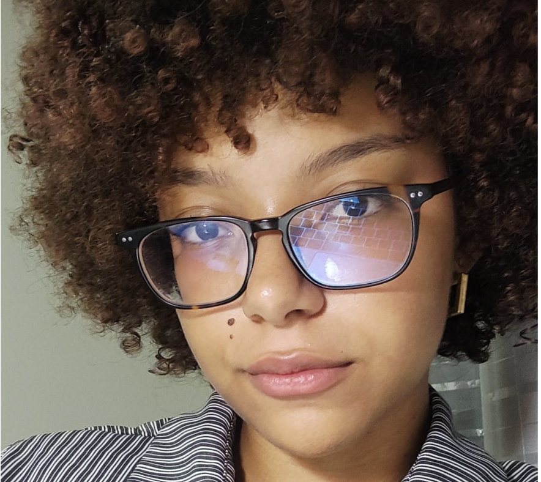

#  Book de IHC e Acessibilidade

Seja bem-vindo ao nosso relatório prático de Interação Humano-Computador. Este documento reúne nossas análises teóricas, avaliações de acessibilidade e os testes práticos realizados ao longo do semestre.

---

##  O Projeto
>  **Objetivo:** Investigar a qualidade da interface e o nível de acessibilidade de sistemas web, aplicando os conceitos de IHC (como as Heurísticas de Nielsen e as normas do eMAG/WCAG) para propor melhorias reais de design e usabilidade.

---

##  Equipe

  

    
    
Giovana Martins de Brito

    
Integrante

    <a href="https://github.com/Giih-martins" target="_blank" style="display: inline-block; font-size: 0.7rem; padding: 4px 10px; background-color: #0369a1; color: #ffffff !important; border-radius: 20px; text-decoration: none; font-weight: 600;">🔗 GitHub</a>
  

 

    
    
Giovanni Mateus de Mendonça Leles

    
Integrante

    <a href="https://github.com/GiovanniMateus" target="_blank" style="display: inline-block; font-size: 0.7rem; padding: 4px 10px; background-color: #0369a1; color: #ffffff !important; border-radius: 20px; text-decoration: none; font-weight: 600;">🔗 GitHub</a>
  

  

    
    
Letícia de Carvalho dos Santos

    
Integrante

    <a href="https://github.com/LeticiaSantosss" target="_blank" style="display: inline-block; font-size: 0.7rem; padding: 4px 10px; background-color: #0369a1; color: #ffffff !important; border-radius: 20px; text-decoration: none; font-weight: 600;">🔗 GitHub</a>
  

  

    
    
Manuella Dal Bianco Perlin Almeida

    
Integrante

    <a href="https://github.com/seu_usuario" target="_blank" style="display: inline-block; font-size: 0.7rem; padding: 4px 10px; background-color: #0369a1; color: #ffffff !important; border-radius: 20px; text-decoration: none; font-weight: 600;">🔗 GitHub</a>
  

  

    
    
Pablo Cunha de Jesus

    
Integrante

    <a href="https://github.com/Pabloo8" target="_blank" style="display: inline-block; font-size: 0.7rem; padding: 4px 10px; background-color: #0369a1; color: #ffffff !important; border-radius: 20px; text-decoration: none; font-weight: 600;">🔗 GitHub</a>
  

  

    
    
Rafaela Andrea Radamés Guerra

    
Líder

    <a href="https://github.com/usuario2" target="_blank" style="display: inline-block; font-size: 0.7rem; padding: 4px 10px; background-color: #0369a1; color: #ffffff !important; border-radius: 20px; text-decoration: none; font-weight: 600;">🔗 GitHub</a>
  

  

    
    
Yasmin Sousa Abdon

    
Integrante

    <a href="https://github.com/usuario3" target="_blank" style="display: inline-block; font-size: 0.7rem; padding: 4px 10px; background-color: #0369a1; color: #ffffff !important; border-radius: 20px; text-decoration: none; font-weight: 600;">🔗 GitHub</a>
  

---

## Licença

Este projeto está licensed sob a Licença MIT - veja o arquivo [LICENSE.md](https://github.com/vitorfleonardo/VerificaAAA/tree/main?tab=License-1-ov-file) para detalhes.
